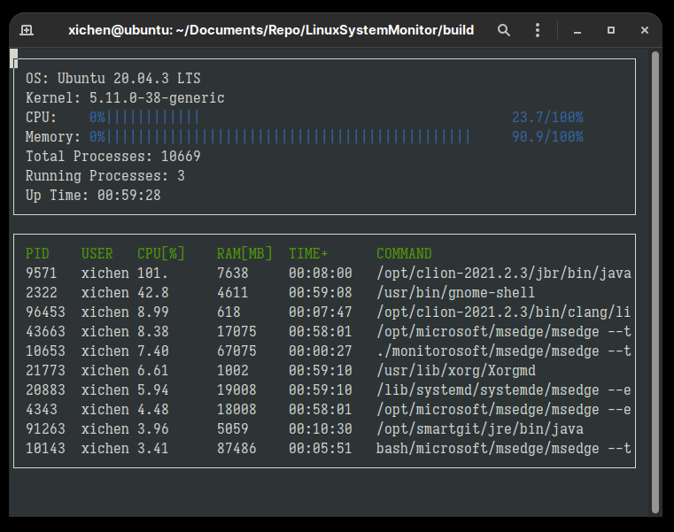

# Linux System Monitor

This is a command line system monitor tool for Linux, similar to `htop`.



## Cloning

```
git clone https://github.com/xichen-de/LinuxSystemMonitor.git
```

## Compiling and Running	

## Dependencies

* cmake >= 3.11
* make >= 4.1
* gcc/g++ >= 5.4
* [ncurses](https://www.gnu.org/software/ncurses/) 

## Compiling

To compile the project, first, create a `build` directory and change to that directory:

```
mkdir build && cd build
```

From within the `build` directory, then run `cmake` and `make` as follows:

```
cmake ..
make
```

### Running

The executable will be placed in the `build` directory. From within `build`, you can run the project as follows:

```
./monitor
```

